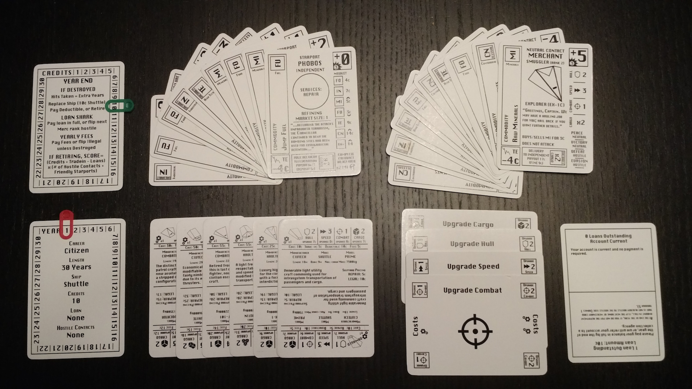
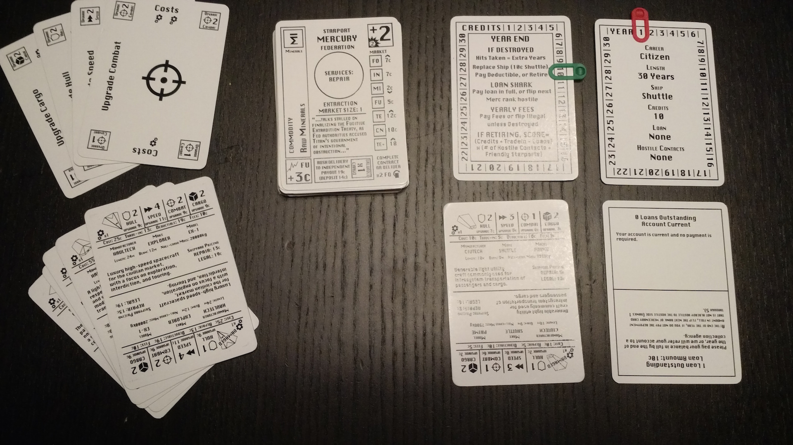
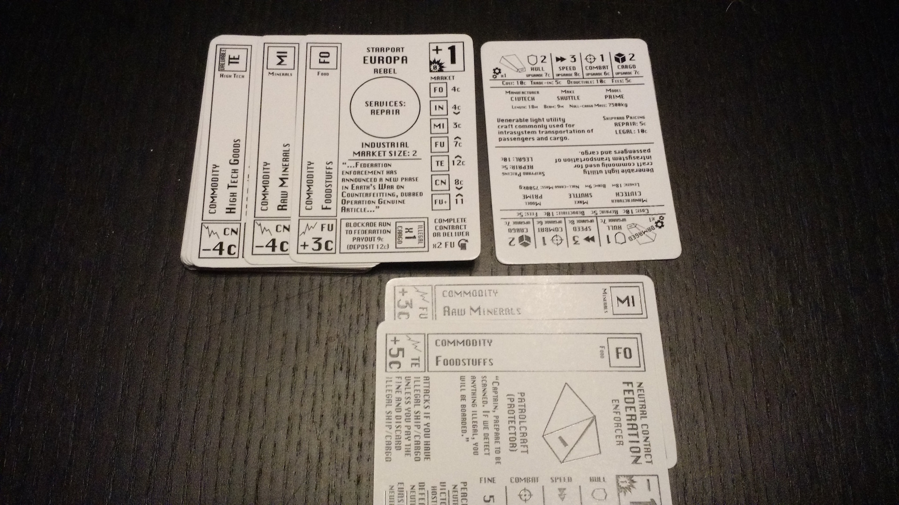
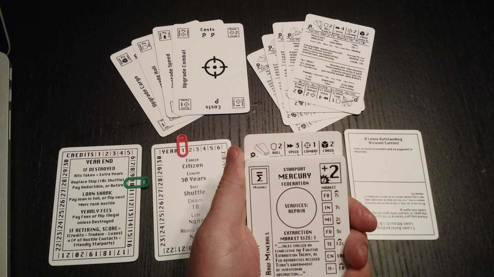
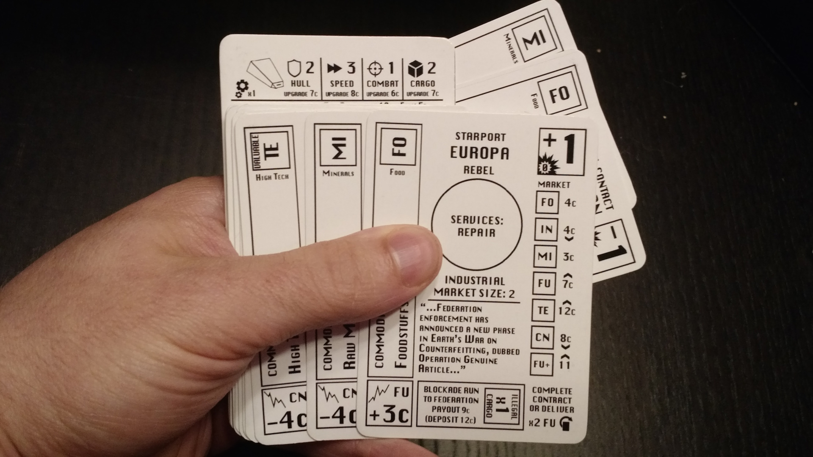
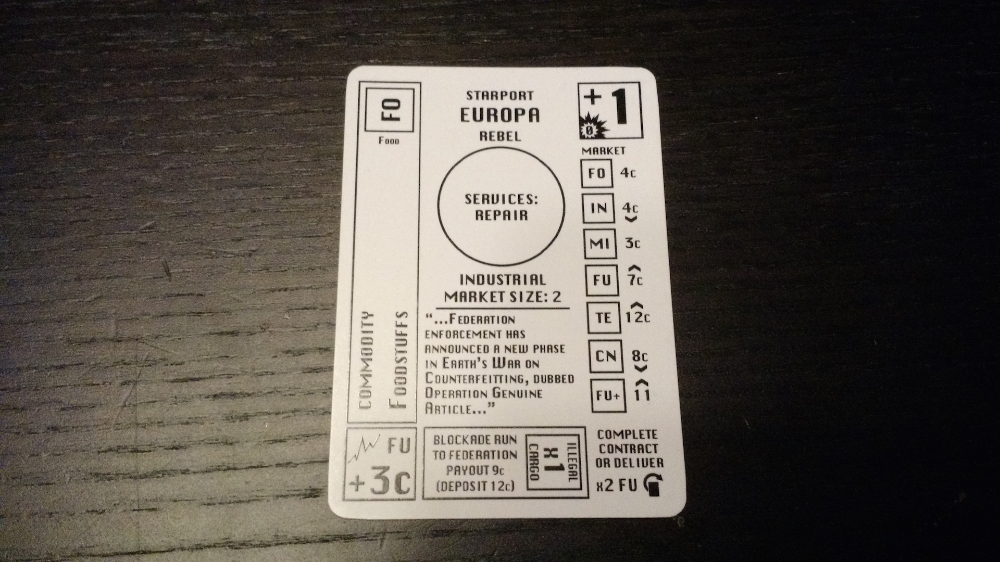
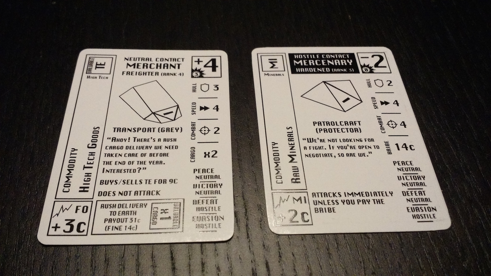
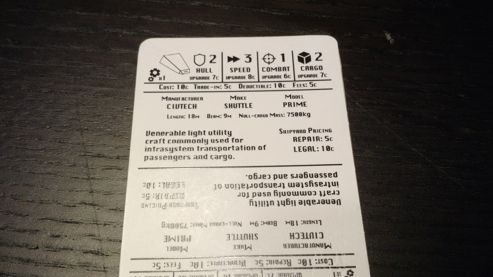
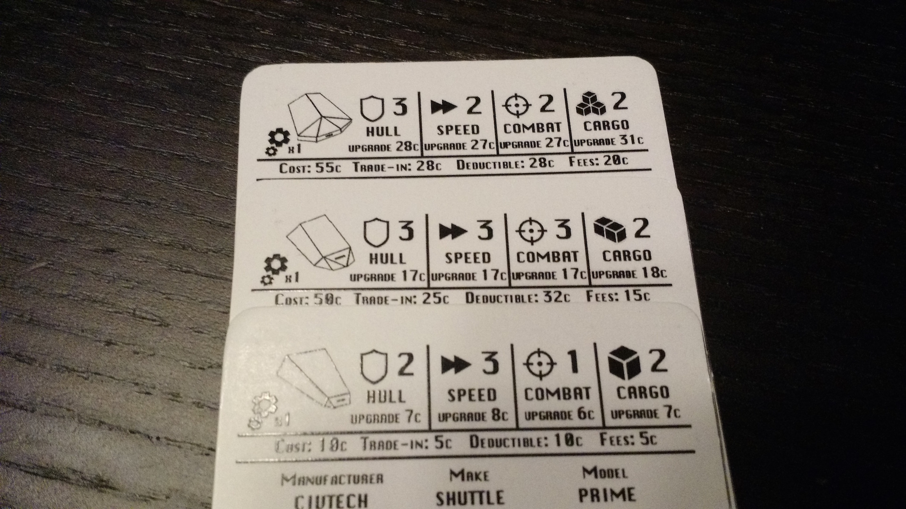
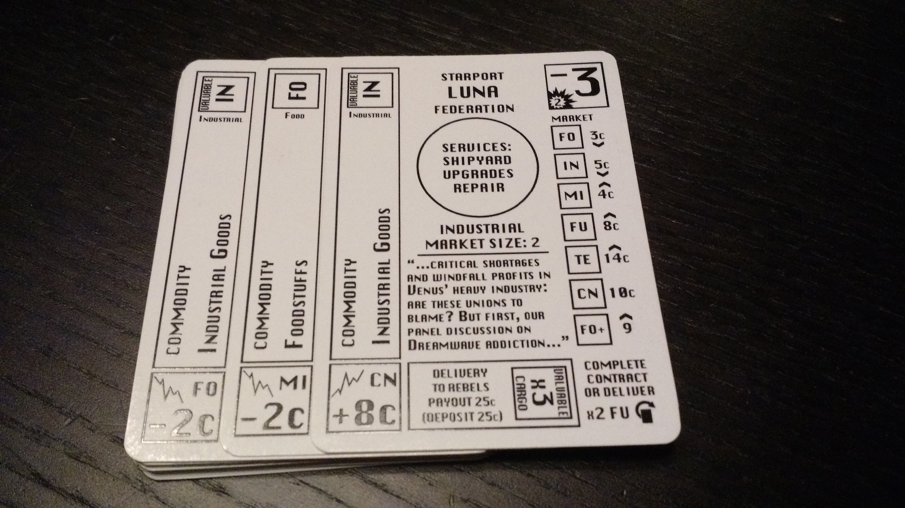

# Hand Solo Game Rules v0.1.5

* [Thematic Overview](#thematic-overview)
* [Components and Setup](#components-and-setup)
* [Game Overview](#game-overview)
* [Outline of Game Structure](#outline-of-game-structure)
* [A Game Turn](#a-game-turn)
* [Game End and Scoring](#game-end-and-scoring)
* [Your Ship](#your-ship)
* [Commodities](#commodities)
* [Design Notes](#design-notes)

## Thematic Overview

You are the captain of a ship – your ship – which you finally scraped enough cash to purchase. Your goal now is to make your mark on our solar system and retire at the end of your career with cash and reknown. Now the only question is: how will you earn your money and fame?

In Hand Solo you spend a set number of years flying about the space system you call home, picking up jobs as you might, making friends and enemies along the way. Your career path is to become as rich and well-known as you can. You can live out the roles of a trader, hauler, smuggler, bounty hunter, pirate, or mercenary.

Hand Solo is a solitaire game which can be played on a table, or just in your hands using no playing surface. It was designed originally for long train commutes where a compact and long game was desired, without the worry of battery life or need for a stable playing surface.

## Components and Setup

### Components



* 31 cards
	* 18 Space cards (9 starport, 9 contact)
	* 6 Ship cards
	* 4 Upgrade cards
	* 1 Credits tracker card
	* 1 Career tracker card
	* 1 Loan tracker card

### Setup

* Shuffle the Space cards together, with the "unknown" sides face up. The side with a title without a black border is the "unknown" side and the side with a black bordered title is the "reknowned" side.
* Take the "shuttle" ship card and place it in front of you. Rotate it so the topmost side is not "illegal" or "damaged".
* Set aside the other 5 ship cards and the 4 modification cards.
* Set the career track to 1 year and the credits track to 10 credits using a paperclip or other marker. Rotate the loan tracker card to the "no loans" side. Place the trackers near you.
* Decide whether you are playing the game on a surface ('On Surface') or without a surface ('In Space').

```
Development Note: You will not need the upgrade cards, or ship cards besides your starting ship in this version.
```

#### Playing on a table ('On Surface')



* Place the Space deck face-up on the table.
* Place the career, credits, and loan tracker nearby.
* Place your ship nearby.
* Leave room nearby for the Space discard.
* When you reveal Space cards when visiting a Starport, splay them to the right to reveal the commodities (see diagram).
* When you discard Space cards, place them in a pile without changing the side that is face-up.
* The year ends when the Space deck is empty.
* Rotate the Space cards to represent cargo in your ship and place them near or under your ship card. (see diagram)



#### Playing in your hand ('In Space')



* Pick up the Space deck with the "unknown" side face up. Place your ship card at the back of the deck, with the top "stats" peeking out over the top of the deck. (see diagram)
* Hold the deck while you play.
* When you reveal Space cards when visiting a Starport, splay them to the right to reveal the commodities. (see diagram)
* When you discard Space cards, place them behind your ship card without changing the side that is face up.
* If you need to flip your ship card to its damaged or illegal side, maintain its position in the deck in front of any discarded cards.
* When you take cargo, stick them in the back of the discard, skewing or rotating them so the cargo is visible. (see diagram)
* The year ends when your ship card is the topmost card in the deck.
* Keep the trackers, ship cards and upgrade cards set aside until you need them (eg: on your lap, in a pocket, on a nearby surface, in the box).



## Game Overview

Each year, you will take a series of turns, in which you reveal the next card in the Encounter deck, either a Starport or a Contact. Starports let you trade commodities, accept and complete contracts, and upgrade or replace your ship, and can be turned friendly if you complete a contract or deliver commodities that are in demand. Contacts include Federation patrols looking for Illegal commodities, Pirates searching for valuable cargo, and traders who will happily exchange commodities with you, hoping you're not a pirate yourself. At the end of each year, you can retire or continue, but you must retire at the end of year 30! Your score is determined by multiplying your credits with your reknown - how many contacts are hostile and how many starports are friendly!

## Outline of game structure

* Each game is divided into a number of rounds (years). 

## A Game Turn

#### Encounter
 * Reveal next card in the Space deck
	* If it's a Contact, resolve Contact text.
	* If it's a Starport, decide to land or bypass.
* Discard all revealed cards
* If there are no more cards, the year ends
* At the end of the year, you may choose to retire, or be forced to retire.

### Starports



#### A Starport Card

* Name
* Reknown
* Government
* Economy Type
* Market Size
* Market
* Market Modifier
* News Bulletin
* Commodity
* Reknown Requirements

#### Encountering a Starport

* Decide to land or bypass.

#### Bypassing

* Discard the Starport.

#### Landing

1. Reveal 
	* Reveal "market" cards based on the market size of the Starport.
	* If there aren't enough cards to reveal because you've reached the end of the deck, reveal as many as possible.
2. Sell commodities
	* You must sell all goods you wish to sell before you buy goods. (See: Selling commodities)
3. Buy commodities
	* After selling, you may buy all goods you wish to buy. (See: Buying commodities)
4. Discard 
	* Discard the starport card and all revealed market cards

* Market size
	* The market size is how many cards you reveal when landing on the planet.
	* Market size 1: reveal 1 card.
	* Market size 2: reveal 2 cards.
	* Market size 3: reveal 3 cards.
* Economy type
	* The starport's economy type summarizes which goods are plentiful, with low prices, and which goods are scarce, with high prices. 

#### Revealing market cards

* "Splay" the starport card to the right so that only the leftmost portion of the card underneath is showing, revealing the commodity information but not the rest of the card. Continue revealing the card under that one until you have revealed all market cards.

#### Good in demand

* Each starport has a good that is in demand. If you sell the listed number of cards of the good in demand, the starport becomes friendly to you.

#### Reknown
* All starports have an attitude towards you, either neutral (you are unknown) or friendly (you are reknowned). All starports begin the game neutral. friendly starports have more favorable prices for goods, and also make advanced goods available.

### Contacts



#### A Contact Card

* Name
* Reknown
* Type
* Subtype
* Hail
* Encounter text
* Commodity
* Market modifier

#### Encountering a Contact

* Resolve the contact's encounter text. (see diagram)
* Discard the contact card once it is resolved.

#### Reknown
* All contacts are neutral for this version of the game. 

#### Pirates

##### Pirate Hunter

* When you encounter a Pirate Hunter, you must discard all valuable cargo.

#### Federation

##### Federation Enforcer

* When you encounter a Federation Enforcer, you must discard all illegal cargo and pay the listed fine.

#### Merchants

##### Courier/Smuggler/Trader/Freighter/Bulk Trader

* When you encounter a Merchant, you may buy or sell one card of the listed commodity for the listed price per unit.

### Year End

#### Ship Fees

#### Retirement

* Forced retirement
	* If you cannot pay the ship fees at the end of a year, you must retire.

## Game End and Scoring

* Wealth: Count total credits.
* Reknown: Count the number of friendly starports.
* Multiply wealth times reknown as your final score.

### Ranking
* Your rank corresponds to your final score.

Score|Rank
---|---
0-10|Citizen
11-20|Pilot
21-40|Free Agent
41-70|Entrepreneur
71-120|Mercenary
121-200|Free Trader
201-330|Tramp Captain
331-540|Merchant
541-880|Privateer
881+|Star Hustler

## Your Ship



* Number of cargo holds
    * The number of cargo holds is how many containers (cards) of cargo it can carry.
* Cargo hold size
    * The cargo hold size is depicted by a number of boxes to the left of the number of cargo holds (one, two or three). Each container holds a number of units of cargo equal to the cargo hold size.


    
* Full cargo
    * Your cargo hold is full when you have as many containers as your cargo hold size.
* Discarding cargo
    * You may freely discard cargo during a Starport or Contact encounter at any time *except* when resolving the encounter text of a Contact card.
* Yearly fees
	* At the end of each year, you must pay the fees shown on your ship card.

### Prices



* Base price
	* Each commodity's base price is shown in the market section of the Starport card.
* Demand arrow
	* The demand arrow shows if a price is higher than average (up arrow), lower than average (down arrow), or average (no arrow). 
* Market modifiers
    * The lower left box on revealed market cards may show a market modifier: The listed good's price is increased or decreased by the amount shown. Note: The market modifier is always ignored on the Starport card itself. Note: a good's price is always at a minimum of '1'.

## Commodities

### Valuable commodities

* Valuable commodities are seized by pirates when pirate contacts are encountered.

### Illegal commodities

* Illegal commodities are seized by federation ships when federation contacts are encountered.

### Advanced commodities
* Advanced commodities have a "plus" sign after their abbreviaton. Advanced commodities buy and sell at the price of their corresponding basic good unless the advanced commodity has a price listed at the Starport market.

### List of Commodities

Commodity|Abbreviation|Valuable|Illegal|Advanced
---|---|---|---|---
Foodstuffs|FO|N|N|N
Raw minerals|MI|N|N|N
Jump fuel|FU|**Y**|N|N
Industrial goods|IN|**Y**|N|N
High tech goods|TE|**Y**|N|N
Contraband shipments|CN|N|**Y**|N
Luxury foods|FO+|N|**Y**|**Y**
Uranium|MI+|**Y**|N|**Y**
Advanced fuels|FU+|**Y**|N|**Y**
Robotic workers|IN+|**Y**|N|**Y**
High tech weapons|TE+|**Y**|**Y**|**Y**

### Buying commodities
* Place the commodity card in the designated area for cargo (See In Space or On Surface). For example, rotate it 90 degrees to the right and tuck it at the back of the deck (in-hand) or behind your ship card (on-surface). Pay the cost in credits of the commodity you are buying (see: commodity prices). Multiply the price of the commodity times the cargo hold size of your ship to determine the price per container. You may not buy a commodity if your cargo hold is full. 
* If you wish to buy commodities, buying commodities must be the last action you take at the starport.
* To buy commodities, first calculate the prices of all commodities you wish to buy, including modifiers. For each good card you wish to buy, decrease your credits by that amount. If you do not have enough credits, you may not buy the commodity. Add the commodity card to your ship. (Eg: by rotating and tucking it in the rear of the deck. Needs more detail). 
* Note: When buying commodities, you can only buy each card once: you cannot buy more "containers" of a commodity than there are cards shown.

### Selling commodities
* You must sell all goods you wish to sell before you can buy goods.
* To sell a commodity card, determine the price (see: Prices), discard the commodity card, and increase your credits by the sell price.

### Discarding cargo

* You may discard cargo freely at any time *except* when resolving the encounter text of a Contact card.

## Design Notes
* Unless changing affinity, never change which side of an encounter card is face up (eg when taking, discarding, etc)
* When splaying cards, if possible, do not reveal more of the card than needed to splay. This avoids the situation where you can use the knowledge of what the card is to influence your decisions. (If you end up memorizing the cards, that's fine, but try not to let it influence you).
* It is up to you whether you will allow yourself to go through the discard to see which cards have already been played. Some people prefer to play this way to decrease the memory and random element, and some prefer to keep the discard hidden for challenge or thematic reasons.
