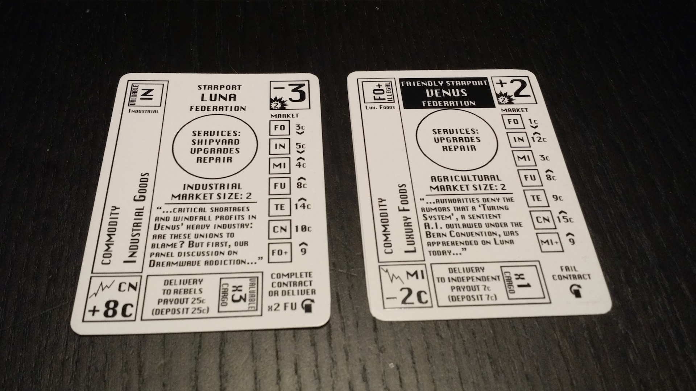

# Hand Solo Game Rules v0.1.6

* [Thematic Overview](#thematic-overview)
* [Components and Setup](#components-and-setup)
* [Game Overview](#game-overview)
* [Outline of Game Structure](#outline-of-game-structure)
* [A Game Turn](#a-game-turn)
* [Game End and Scoring](#game-end-and-scoring)
* [Your Ship](#your-ship)
* [Commodities](#commodities)
* [Design Notes](#design-notes)

## Thematic Overview

You are the captain of a ship – your ship – which you finally scraped enough cash together to purchase. Your goal now is to make your mark on our solar system and retire at the end of your career with cash and renown. Now the only question is: how will you earn your money and fame?

In Hand Solo you spend a set number of years flying about the space system you call home, picking up jobs as you might and  making friends and enemies along the way. Your career path is to become as rich and well-known as you can. You can live out the roles of a trader, hauler, smuggler, bounty hunter, pirate, or mercenary.

Hand Solo is a solitaire game which can be played on a table, or just in your hands using no playing surface. It was designed originally for long train commutes where a compact and long game was desired, without the worry of battery life or need for a stable playing surface.

## Components and Setup

### Components

* 31 cards
	* 18 Space cards (9 starport, 9 contact)
	* 6 Ship cards
	* 4 Upgrade cards
	* 1 Credits tracker card
	* 1 Career tracker card
	* 1 Loan tracker card

`Development note: To use the credit and year tracker cards, you will need to supply two markers (eg, counters, or paperclips) to track credits and the current year. You can also write the year and credits on paper, use an app, etc.`

### Setup

* Shuffle the Space cards together, with the "unknown" sides face up. The side with a title without a black border is the "unknown" side and the side with a black bordered title is the "renowned" side. The "unknown" side is face-up, and the "renowned" side is face-down.
* Take the "shuttle" ship card and place it in front of you. Rotate it so the topmost side is not "illegal" or "damaged".
* Set aside the other 5 ship cards and the 4 modification cards.
* Set the career track to 1 year and the credits track to 10 credits using a paperclip or other marker. Rotate the loan tracker card to the "no loans" side. Place the trackers near you.
* Decide whether you are playing the game on a surface ('On Surface') or without a surface ('In Space').

`Development Note: You will not need the loan card, upgrade cards or ship cards besides your starting ship in this version.`

#### Playing on a table ('On Surface')

* Place the Space deck face-up on the table.
* Place the career, credits, and loan tracker nearby.
* Place your ship card nearby.
* Leave room nearby for the Space discard.
* When you reveal Space cards when visiting a Starport, splay them to the right to reveal the commodities (see diagram).
* When you discard Space cards, place them in a pile without changing the side that is face-up.
* The round ends when the Space deck is empty.
* The Space cards are used to represent cargo in your ship. When using them as cargo, rotate the cards to the left or right 90 degrees and place them near or under your ship card. (see diagram)

#### Playing in your hand ('In Space')

* Pick up the Space deck with the "unknown" side face up. Place your ship card at the back of the deck, with the top "stats" peeking out over the top of the deck. (see diagram)
* Hold the deck while you play.
* When you reveal Space cards when visiting a Starport, splay them to the right to reveal the commodities. (see diagram)
* When you discard Space cards, place them behind your ship card without changing the side that is face up.
* If you need to flip your ship card to its damaged or illegal side, maintain its position in the deck in front of any discarded cards.
* When you take cargo, stick the Space cards representing the cargo in the back of the discard, skewing or rotating them so the cargo is visible. (see diagram)
* The round ends when your ship card is the topmost card in the deck.
* Keep the trackers, ship cards and upgrade cards set aside until you need them (eg: on your lap, in a pocket, on a nearby surface, in the box).

## Game Overview

Each year, you will take a series of turns, in which you reveal the next card in the Space deck, either a Starport or a Contact. Starports let you trade commodities, accept and complete contracts, and upgrade or replace your ship, and can be turned friendly if you complete a contract or deliver commodities that are in demand. Contacts include Federation patrols looking for illegal commodities, Pirates searching for valuable cargo, and traders who will happily exchange commodities with you, hoping you're not a pirate yourself. At the end of each year, you can retire or continue, but you must retire at the end of year 30! Your score is determined by multiplying your wealth (your credits) with your renown - a count of how many contacts are hostile and how many starports are friendly!

## Outline of game structure

### Round setup

Shuffle the Space deck at the start of each round.

### A Game Round (One year)

Each round is a series of Game Turns, each of which is one *encounter*, where you will interact with the top card of the Space deck, which is either a Starport card or a Contact card. At the end of an encounter, discard all revealed cards and take another turn, resolving the encounter on the next card in the Space deck. Or, if the Space deck is empty, the round ends.

### End of a Round

And the end of the round, you must either pay your fees (See: Your Ship) to continue and begin a new round, or retire and end the game. At the end of round 30, you must retire.

### End of the Game

At the end of the game, determine your score by multiplying your wealth and your renown. Your wealth is equal to your credits. Your renown is the number of cards in the Space deck on the "renowned" side (friendly or hostile). Your rank at the end of the game is based on this score. (See: Game End and Scoring)

## A Game Turn

### Encounter
At the start of each turn, a Space card is revealed. If it's a Contact, resolve the Contact text (See: Contacts). If it's a Starport, decide to *land* or *bypass* (See: Starports). After resolving the encounter, discard all revealed cards to reveal the next card in the Space deck. If there are no more cards, the round (the year) ends; follow the End of a Round procedure.

### Starports

#### A Starport Card

* Name - The name of the Starport.
* Reknown - Whether the Starport is neutral or friendly.
* Government - Federation, Independent, Rebel or Outlaw.
* Economy Type - Different economy types produce and demand different commodity types.
* Market Size - The number of commodity cards revealed upon landing.
* Market - The base prices for commodities.
* News Bulletin - Current events at the Starport. Flavor text.
* Reknown Requirements - What's needed to flip the Starport from the unknown to renown side (or vice versa).
* Commodity - The commodity on this Starport card.
* Market Modifier - Modifies commodity prices.

#### Encountering a Starport

Decide to *land* or *bypass*.

#### Bypassing

Discard the Starport card, revealing the next Space card.

#### Landing

1. Reveal
	* Reveal "market" cards based on the market size of the Starport. (See: Market size)
	* If there aren't enough cards to reveal because you've reached the end of the deck, reveal as many as possible.
2. Sell commodities
	* You must sell all goods you wish to sell before you buy goods. (See: Selling commodities)
3. Buy commodities
	* After selling, you may buy all goods you wish to buy. (See: Buying commodities)
4. Discard
	* Discard the Starport card and all revealed market cards, revealing the next Space card.

#### Market size

The market size determines how many cards you reveal when landing on the planet. For example, if the market size is "1", splay the Starport card to the right to reveal one card underneath, ensuring only the leftmost "commodity" side is visible.

Market Size|Number of cards revealed
---|---
Market size 1|Reveal 1 card
Market size 2|Reveal 2 cards
Market size 3|Reveal 3 cards

#### Economy type

The Starport's economy type is an indicator of which goods are plentiful, with low prices, and which goods are scarce, with high prices. For example, in Refinery economies, fuel is produced, and has a low price, while minerals are in demand because they are used for fuel production, and have a high price.

#### Revealing market cards

Splay the Starport card to the right so that only the leftmost portion of the card underneath is showing, revealing the commodity information but not the rest of the card. Continue revealing the card under that one until you have revealed all market cards. If there are not enough cards left in the Space deck to reveal, reveal as many as possible.

#### Commodity in demand

Each unknown Starport has a commodity that is in demand. If you *deliver* the listed number of cards of the commodity in demand, the Starport becomes friendly to you. To deliver the commodity, discard a number of cards equal to the demand number, and immediately flip the Starport to the renowned side.

`Note: When delivering the commodity in demand, you are not selling it - you do not receive the sell price when you discard it.`

#### Reknown
All starports have an attitude towards you, either neutral (you are unknown) or friendly (you are renowned). All Starports begin the game neutral. Friendly starports have more favorable prices for commodities, and also make advanced commodities available.

### Contacts

#### A Contact Card

* Name - The name of the Contact.
* Reknown - Whether the Contact is neutral or hostile.
* Faction - The faction of the Contact, Federation, Pirate, Merchant, Mercenary.
* Subtype - The subtype of the Contact
* Hail - The Contact's communication with you when the encounter begins. Flavor text.
* Encounter text - Text that is resolved immediately when this Contact is encountered.
* Commodity - The commodity on this Starport card.
* Market Modifier - Modifies commodity prices.

#### Encountering a Contact

1. Resolve the contact's encounter text. (See diagram)
2. Discard the contact card once it is resolved, revealing the next Space card.

`Development note: In future versions of Hand Solo, when encountering a Contact, some encounter text may initiate combat with you, and it may be possible to initiate combat with a Contact.`

#### Reknown
All contacts remain on the "unknown" (neutral) side for this version of the game.

`Development note: In future versions of Hand Solo, Contacts can change from neutral to hostile depending on your actions. For example, if you defeat a Federation Contact, they will flip to the "hostile" side, which has encounter text specifying that they will attack you during each encounter.`

#### Pirates

##### Pirate Hunter

When you encounter a Pirate Hunter, you must discard all valuable cargo.

`Example: You encounter a Pirate Hunter and have one Contraband Shipment (CN) card and one Jump Fuel (FU) card in your cargo hold. You discard the Jump Fuel card.`

#### Federation

##### Federation Enforcer

When you encounter a Federation Enforcer, you must discard all illegal cargo and pay the listed fine. Regardless of how many cards of illegal cargo you have, only pay the fine once.

`Example: You encounter a Federation Enforcer and have two CN cards in your cargo hold. You discard both cards and pay the listed fine once.`

#### Merchants

##### Courier/Smuggler/Trader/Freighter/Bulk Trader

When you encounter a Merchant, you may buy or sell one card of the listed commodity for the listed price per unit.

`Example: You encounter a Merchant and have no cards in your cargo hold. You may pay the price in the encounter text to add the Contact card to your cargo hold as a commodity.`

#### Pirate Marauders/Federation Interceptors/Mercenaries

These Contacts are not included in this version of Hand Solo.

## Round End

The round ends when there are no more cards in the Space deck after an encounter. You must decide to continue your career or retire. If you cannot pay your ship fees in full because you do not have enough credits, you must retire.

### Continue career

If you have not reached the maximum length of your career (by default, this is 30 years), you may pay your ship fees and continue to the next round.

#### Pay ship fees

Your fee is located on your ship card (See: Your Ship). Decrease your credits by the ship fees. if you cannot pay the fees in their entirety, you must retire.

#### Advance year

Advance the year on the Year tracker, then perform Round Setup for the next round.

### Retirement

When you decide to retire, your career ends. Perform the procedure in Game End and Scoring to calculate your score and rank.

## Game End and Scoring

Your final score is determined by your wealth (total credits) and your renown (the number of Starport cards and Contact cards in the deck that are on the "renowned" side).

### Wealth

Your wealth is equal to your credits.

### Renown

Your renown is the number of Starport and Contact cards in the deck that are on the "renowned" side.

### Score

Multiply wealth times renown as your final score.

### Ranking

Your rank corresponds to your final score.

Score|Rank
---|---
0-10|Citizen
11-20|Pilot
21-40|Free Agent
41-70|Entrepreneur
71-120|Mercenary
121-200|Free Trader
201-330|Tramp Captain
331-540|Merchant
541-880|Privateer
881+|Star Hustler

## Your Ship

### A ship card

* Manufacturer - The ship manufacturer.
* Make - The make of ship.
* Model - The model of ship.
* Cost - The cost of the ship in credits.
* Trade-in - The trade-in for the ship in credits when buying a new ship.
* Deductible - The deductible you pay when replacing a destroyed ship.
* Fees - Yearly fees for the ship.
* Repair - Cost in credits to repair the ship.
* Legal - Legal fees in credits you pay to clear the ship's legal record.
* Stats - Mass and dimensions of the ship.
* Description - Description of the ship.
* Hull - A measure of the ship's hull strength and size.
* Speed - A measure of the ship's maneuverability and acceleration.
* Combat - A measure of the ship's firepower and combat ability.
* Cargo holds - The number of containers (individual cards) of cargo the ship can carry.
* Cargo hold size - The number of units of cargo each cargo hold (card) represents.
* Upgrade space - The number of upgrade slots the ship has in its default configuration.
* Upgrade costs - The cost to upgrade the Hull, Speed, Combat, or Cargo Holds by one.
* Illegal/Damaged - Whether the ship is currently illegal or damaged.

### Number of cargo holds
The number of cargo holds is how many containers (cards) of cargo it can carry.

### Cargo hold size
The cargo hold size is depicted by a number of boxes to the left of the number of cargo holds (one, two or three). Each container holds a number of units of cargo equal to the cargo hold size. When buying or selling commodities, you multiply the unit price times the cargo hold size to determine the total price.

### Full cargo
Your cargo hold is full when you have as many containers as your cargo hold size.

### Discarding cargo
You may freely discard cargo during a Starport or Contact encounter at any time *except* when resolving the encounter text of a Contact card.

### Fees
At the end of each round, to continue your career for another year, you must pay the fee shown on your ship card.

`Development note: In this version of Hand Solo, some stats on your ship card are unused. The Hull, Speed, Combat, upgrade cost, upgrade space, cost, trade-in, deductible, legal, and repair stats are unused. The sides of the ship card with the 'illegal' and 'damaged' labels are unused.`

## Commodities

Different Starports produce and consume different commodities. Savvy traders can earn a living by purchasing commodities where they are produced and available cheaply, and selling them where they are in demand and expensive. Buying and selling commodities for a profit is one of the primary ways to earn credits in Hand Solo.

`Development note: In this version of Hand Solo, contracts, piracy, and bounty hunting are not implemented. The only ways to earn credits are via trading in legal commodities and smuggling illegal commodities.`

### Prices

* Base price
	* Each commodity's base price is shown in the market section of the Starport card.
* Demand arrow
	* The demand arrow shows if a price is higher than average (up arrow), lower than average (down arrow), or average (no arrow).
* Market modifiers
    * The lower left box on revealed market cards may show a market modifier: The listed good's price is increased or decreased by the amount shown. Note: The market modifier is always ignored on the Starport card itself. Note: a good's price is always at a minimum of '1'.

#### Pricing Example

* The pricing example is after landing at Starport Ganymede.
* With a market size of 2, the revealed commodities are **FU**, and **TE**, and **IN** is on Starport Ganymede itself.
* Market modifiers on the revealed commodity cars are **FO: +3c**, **TE: -4c**.
* The modifier on the Starport Ganymede card (**FO: -2c**) is ignored.
* You may buy one container of FU for 2c, TE for 3c, and IN for 5c.
* For example, if your ship had a cargo hold size of 2, you would pay 4c for one card of FU, 6c for one card of TE, and 10c for one card of IN.

Commodity|Base price|Modifier|Final price
---|---|---|---
FO|4c|+3c|**7c**
IN|5c (low)|--|5c
MI|4c (high)|--|4c
FU|2c (low)|--|2c
TE|7c (low)|-4c|**3c**
CN|10c|--|10c
MI+|7c (high)|--|7c

### Valuable commodities

Valuable commodities are seized by pirates when pirate contacts are encountered.

### Illegal commodities

Illegal commodities are seized by federation ships when federation contacts are encountered.

### Advanced commodities
Advanced commodities have a "plus" sign after their abbreviaton. Advanced commodities buy and sell at the price of their corresponding basic good (the abbreviation without a "plus" sign) unless the advanced commodity has a separate price listed at the Starport market.

`Note: Advanced commodities are in demand only at certain Starports, where they will have a high price.`

### List of Commodities

Commodity|Abbreviation|Valuable|Illegal|Advanced
---|---|---|---|---
Foodstuffs|FO|N|N|N
Raw minerals|MI|N|N|N
Jump fuel|FU|**Y**|N|N
Industrial goods|IN|**Y**|N|N
High tech goods|TE|**Y**|N|N
Contraband shipments|CN|N|**Y**|N
Luxury foods|FO+|N|**Y**|**Y**
Uranium|MI+|**Y**|N|**Y**
Advanced fuels|FU+|**Y**|N|**Y**
Robotic workers|IN+|**Y**|N|**Y**
High tech weapons|TE+|**Y**|**Y**|**Y**

### Buying commodities
* If you wish to buy commodities, buying commodities must be the last action you take at the starport.
* To buy commodities, first calculate the prices of all commodities you wish to buy, including modifiers. For each commodity card you wish to buy, decrease your credits by that amount. If you do not have enough credits, you may not buy the commodity.
* Pay the cost in credits of the commodity you are buying (see: commodity prices). Multiply the price of the commodity times the cargo hold size of your ship to determine the price per container. You may not buy a commodity if your cargo hold is full.
* Place the commodity card in the designated area for cargo (See In Space or On Surface). For example, rotate it 90 degrees to the right and tuck it at the back of the deck (in-hand) or behind your ship card (on-surface).
* Note: When buying commodities, you can only buy each card once: you cannot buy more "containers" of a commodity than there are cards shown.

### Selling commodities
* You must sell all commodities you wish to sell before you can buy commodities.
* To sell a commodity card, determine the price (see: Prices), discard the commodity card, and increase your credits by the sell price.
* Multiply the price of the commodity times the cargo hold size of your ship to determine the price per container.

## Errata

### Commodities

Fuel is "valuable", though it is not marked on the commodity cards.

### Contracts

Though it is not implemented in this version of Hand Solo, instead of paying a "fine" for failing a Merchant Contract as is indicated on the card, the penalty is instead to flip the Contact to the "hostile" side.

## Design Notes
* Unless changing affinity, never change which side of a Space card is face up (eg when taking, discarding, etc)
* When splaying cards, if possible, do not reveal more of the card than needed to splay. This avoids the situation where you can use the knowledge of what the card is to influence your decisions. (If you end up memorizing the cards, that's fine, but try not to let it influence you).
* It is up to you whether you will allow yourself to go through the discard to see which cards have already been played. Some people prefer to play this way to decrease the memory and random element, and some prefer to keep the discard hidden for challenge or thematic reasons.
